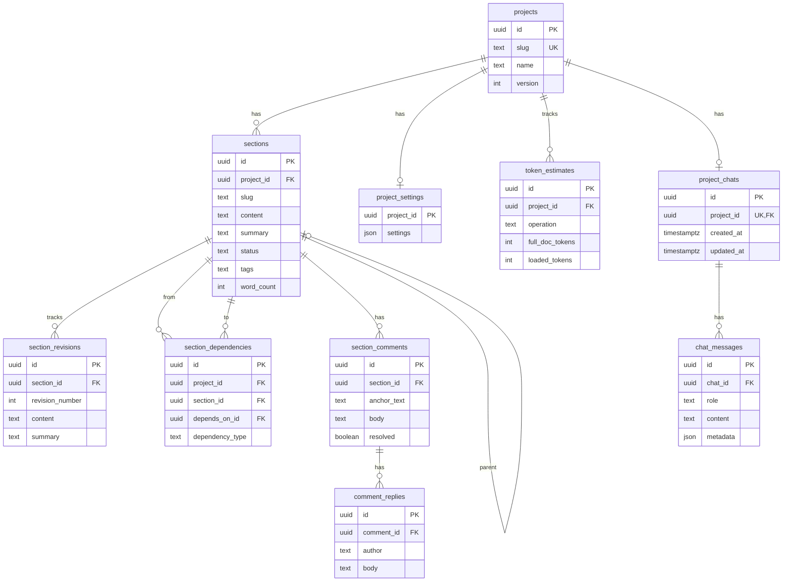
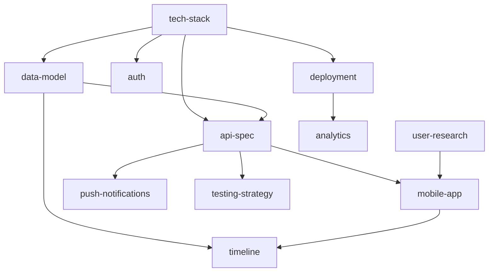

# Data Model

## Entity Relationship Diagram

## Dependency Types

When linking sections with `prd_add_dependency`, use one of these types:

| Type | Meaning | Example |
|------|---------|---------|
| `blocks` | Section cannot proceed until dependency is complete | `pipeline` blocks `api-spec` |
| `extends` | Section builds upon or extends the dependency | `api-spec` extends `data-model` |
| `implements` | Section implements what the dependency specifies | `ui-design` implements `api-spec` |
| `references` | Section references the dependency for context (default) | `security` references `tech-stack` |

## Tags

Tags categorize sections for filtering and search (via `prd_search(query="tag:mvp")`):

| Tag | Purpose |
|-----|---------|
| `mvp` | Part of minimum viable product scope |
| `core` | Core system functionality |
| `infra` | Infrastructure and deployment concerns |
| `ai` | AI/ML related components |
| `frontend` | User-facing interface components |

Tags are freeform — you can create any tag. The above are conventions used in the seed data.

## Section Statuses

| Status | Meaning |
|--------|---------|
| `draft` | Initial writing, not yet reviewed |
| `in_progress` | Actively being worked on |
| `review` | Ready for review |
| `approved` | Finalized and approved |
| `outdated` | Needs update due to changes in dependencies |

## Dependency Graph (SnapHabit Example)

This graph shows the dependencies in the default seed (`02_seed.sql`):

