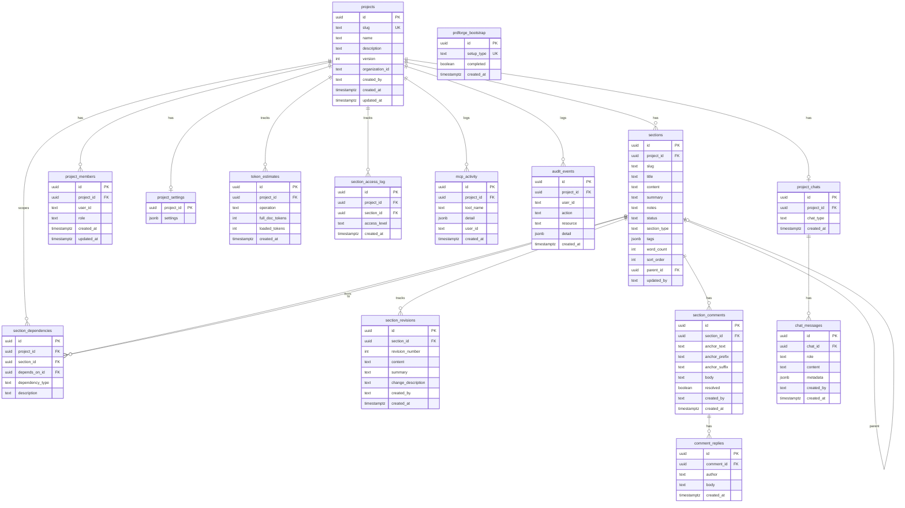
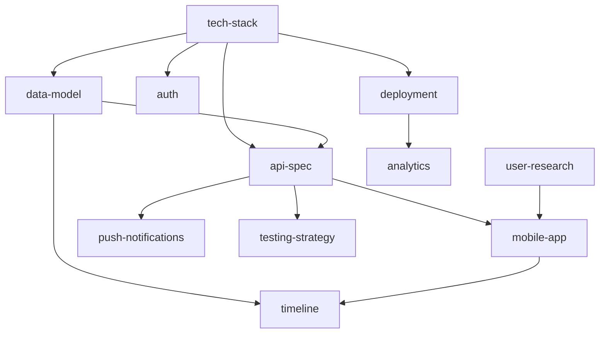

# Data Model

**Last updated:** 2026-03-20
**Status:** Current
**Audience:** Contributors, integrators, MCP tool developers

---

## Overview

PRDforge stores all project data in PostgreSQL. The schema supports multi-user collaboration with role-based access, real-time presence via WebSocket tokens, and session-based token savings tracking.

## Table of Contents

- [Entity Relationship Diagram](#entity-relationship-diagram)
- [Core Tables](#core-tables)
- [Multi-User Tables](#multi-user-tables)
- [Analytics Tables](#analytics-tables)
- [Dependency Types](#dependency-types)
- [Section Statuses](#section-statuses)
- [Tags](#tags)
- [Dependency Graph Example](#dependency-graph-example)

---

## Entity Relationship Diagram

---

## Core Tables

### `projects`

Top-level container for a PRD. Each project has a unique slug used in URLs and MCP tool calls.

| Column | Type | Description |
|:-------|:-----|:-----------|
| `id` | UUID | Primary key |
| `slug` | TEXT | Unique URL-safe identifier (e.g., `snaphabit`) |
| `name` | TEXT | Display name |
| `description` | TEXT | Optional project description |
| `version` | INT | Incremented on structural changes |
| `organization_id` | TEXT | Optional org scope (Better Auth) |
| `created_by` | TEXT | Better Auth user ID of creator |

### `sections`

Individual PRD sections within a project. Each section has content, metadata, and optional parent for nesting.

| Column | Type | Description |
|:-------|:-----|:-----------|
| `id` | UUID | Primary key |
| `project_id` | UUID | FK → projects |
| `slug` | TEXT | Unique within project (e.g., `data-model`) |
| `title` | TEXT | Display title |
| `content` | TEXT | Markdown content |
| `summary` | TEXT | Short summary for `prd_get_overview` |
| `notes` | TEXT | Private notes (accordion in UI) |
| `status` | TEXT | Workflow status (see [Section Statuses](#section-statuses)) |
| `section_type` | TEXT | Category (overview, tech_spec, data_model, etc.) |
| `tags` | JSONB | Array of string tags |
| `word_count` | INT | Auto-calculated on content change |
| `sort_order` | INT | Display ordering |
| `parent_id` | UUID | FK → sections (self-referential, for nesting) |

### `section_revisions`

Immutable revision history. A new revision is created automatically on every `prd_update_section` that changes content.

### `section_dependencies`

Directed edges between sections. See [Dependency Types](#dependency-types) for the type enum.

### `section_comments`

Inline comments anchored to selected text within a section. Supports resolve/reopen toggle.

### `comment_replies`

Threaded replies on comments. Created by users or auto-generated when a comment is resolved via `prd_update_section(resolve_comments=[...])`.

---

## Multi-User Tables

### `project_members`

Maps users to projects with role-based access. User IDs are Better Auth format (32-char random strings, not UUIDs).

| Column | Type | Description |
|:-------|:-----|:-----------|
| `user_id` | TEXT | Better Auth user ID |
| `role` | TEXT | One of: `owner`, `admin`, `editor`, `commenter`, `viewer` |

**Role hierarchy:** owner > admin > editor > commenter > viewer. Each role inherits all permissions of lower roles.

### `prdforge_bootstrap`

Controls first-user setup flow. When empty (no rows), the system operates in pre-setup mode — all endpoints are open, no auth enforced.

### `audit_events`

Logs user actions for project audit trail. Indexed by project and user.

---

## Analytics Tables

### `token_estimates`

Per-operation token tracking. Written on every MCP read tool call. Source for the "Savings by Operation" chart and daily trend.

| Column | Type | Description |
|:-------|:-----|:-----------|
| `operation` | TEXT | MCP tool name (e.g., `read_section`, `get_overview`) |
| `full_doc_tokens` | INT | What full document load would have cost |
| `loaded_tokens` | INT | What was actually loaded |

### `section_access_log`

Session-based access tracking with coverage levels. Primary source for the savings gauge. See [Token Stats Metrics](./token-stats-metrics.md) for detailed explanation.

| Column | Type | Description |
|:-------|:-----|:-----------|
| `access_level` | TEXT | `full`, `summary`, or `snippet` |

### `mcp_activity`

Logs all mutating MCP tool calls (12 tools) with detail JSON. Source for the "Write Operations" donut chart.

---

## Dependency Types

When linking sections with `prd_add_dependency`, use one of these types:

| Type | Meaning | Example |
|:-----|:--------|:--------|
| `blocks` | Section cannot proceed until dependency is complete | `data-model` blocks `api-spec` |
| `extends` | Section builds upon the dependency | `api-spec` extends `data-model` |
| `implements` | Section implements what the dependency specifies | `ui-design` implements `api-spec` |
| `references` | Section references the dependency for context (default) | `security` references `tech-stack` |

The dependency graph in the UI uses these types for edge coloring:
- `blocks` — red edges
- `extends` — blue edges
- `implements` — green edges
- `references` — gray edges

---

## Section Statuses

| Status | Meaning | Dot color |
|:-------|:--------|:----------|
| `draft` | Initial writing, not yet reviewed | Gray |
| `in_progress` | Actively being worked on | Yellow |
| `review` | Ready for review | Blue |
| `approved` | Finalized and approved | Green |
| `outdated` | Needs update due to changes in dependencies | Red |

Status is set via the dropdown in the section viewer header or via `prd_update_section(status="approved")`.

---

## Tags

Tags categorize sections for filtering and search. Query with `prd_search(query="tag:mvp")`.

| Tag | Purpose |
|:----|:--------|
| `mvp` | Part of minimum viable product scope |
| `core` | Core system functionality |
| `infra` | Infrastructure and deployment |
| `ai` | AI/ML related components |
| `frontend` | User-facing interface |

Tags are freeform — create any tag that fits your project. The above are conventions from the SnapHabit seed data.

---

## Dependency Graph Example

The default SnapHabit seed data (`db/02_seed.sql`) creates this dependency structure:

---

## Migration Files

Schema is applied via ordered SQL files in `db/`:

| File | Purpose |
|:-----|:--------|
| `01_init.sql` | Core tables (projects, sections, revisions, dependencies) |
| `02_seed.sql` | SnapHabit seed data (12 sections, 12 dependencies) |
| `03_comments.sql` | Section comments and replies |
| `04_replies_and_settings.sql` | Comment replies, project settings |
| `05_token_stats.sql` | Token estimates tracking |
| `06_chat.sql` | Project chats and messages |
| `07_multi_user.sql` | Project members, bootstrap, bridge columns (TEXT not UUID) |
| `08_mcp_activity.sql` | MCP tool activity logging |
| `09_audit.sql` | Audit events |
| `10_password_reset.sql` | Admin password reset tokens |
| `11_chat_multiuser.sql` | Chat type column, user attribution |
| `12_better_auth.sql` | Better Auth session/user tables |
| `13_section_access_log.sql` | Session-based access tracking |

All migrations are idempotent (`CREATE TABLE IF NOT EXISTS`, `DO $$ BEGIN ... END $$` guards).
